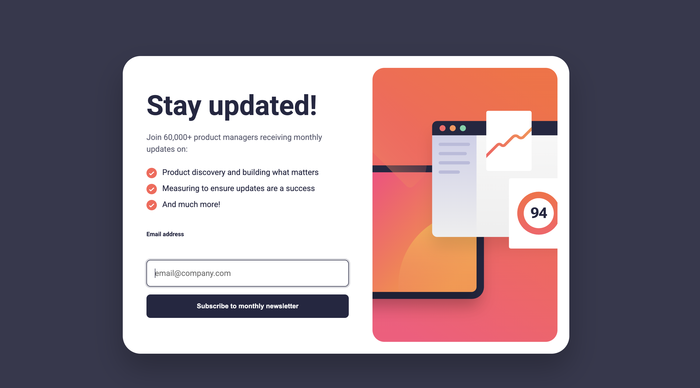
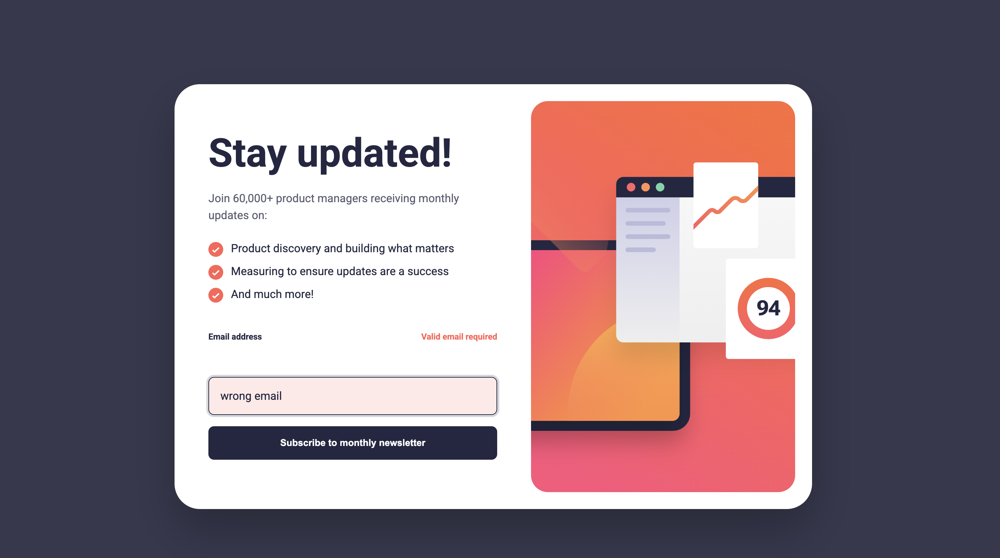
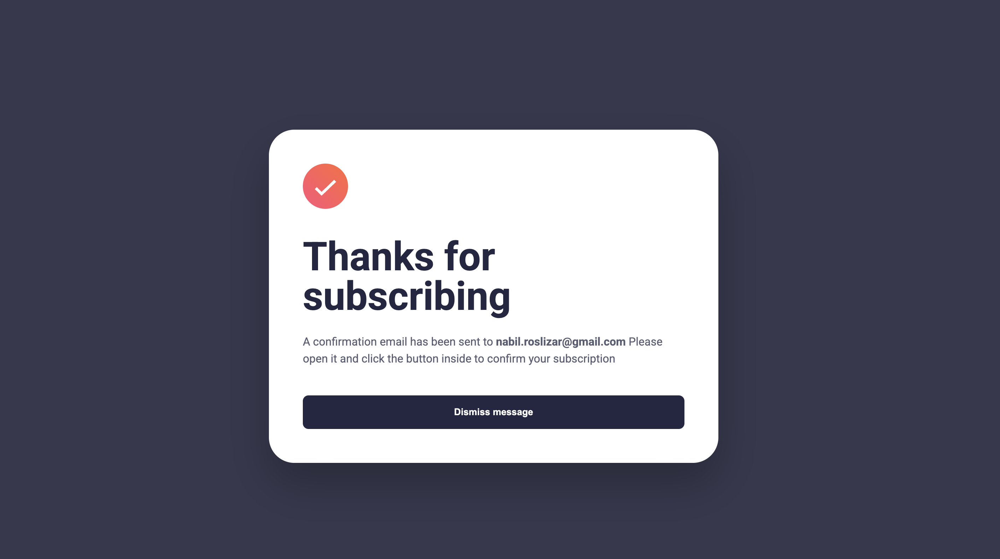

NEWSLETTER SIGNUP FORM

### Screenshot

### Tech Stack: 
HTML
CSS 
Javascript

### The challenge

Users should be able to:

- Add their email and submit the form
- See a success message with their email after successfully submitting the form
- See form validation messages if:
  - The field is left empty
  - The email address is not formatted correctly
- View the optimal layout for the interface depending on their device's screen size
- See hover and focus states for all interactive elements on the page

### Process Step-by-Step for this project
- Step 0 - Project Structure 
- Step 1 - Build the HTML
    - sign up form view
    - sucess message
- Step 2 - Add CSS foundation (so layout wont fight you)
    - baseline color, font, page height, toggling
- Step 3 : JS + Validation
    - when user submits:
    - show error if empty
    - show error if invalid email
    - otherwise switch to success screen + show their email
    - dismiss button returns to form
- Step 4 : Real Layout + Responsiveness
    - layout wrapper 
    - Responsive design
    - active states
    - Typography
    - Visual Polish
- Step 5 : Deploy

### Links

- Solution URL: [Add solution URL here](https://your-solution-url.com)
- Live Site URL: [Add live site URL here](https://your-live-site-url.com)